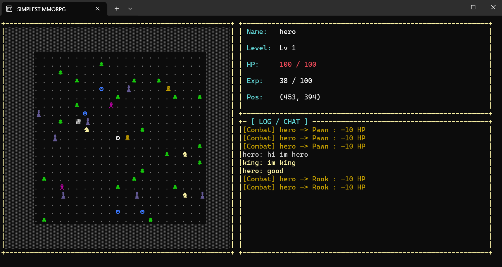
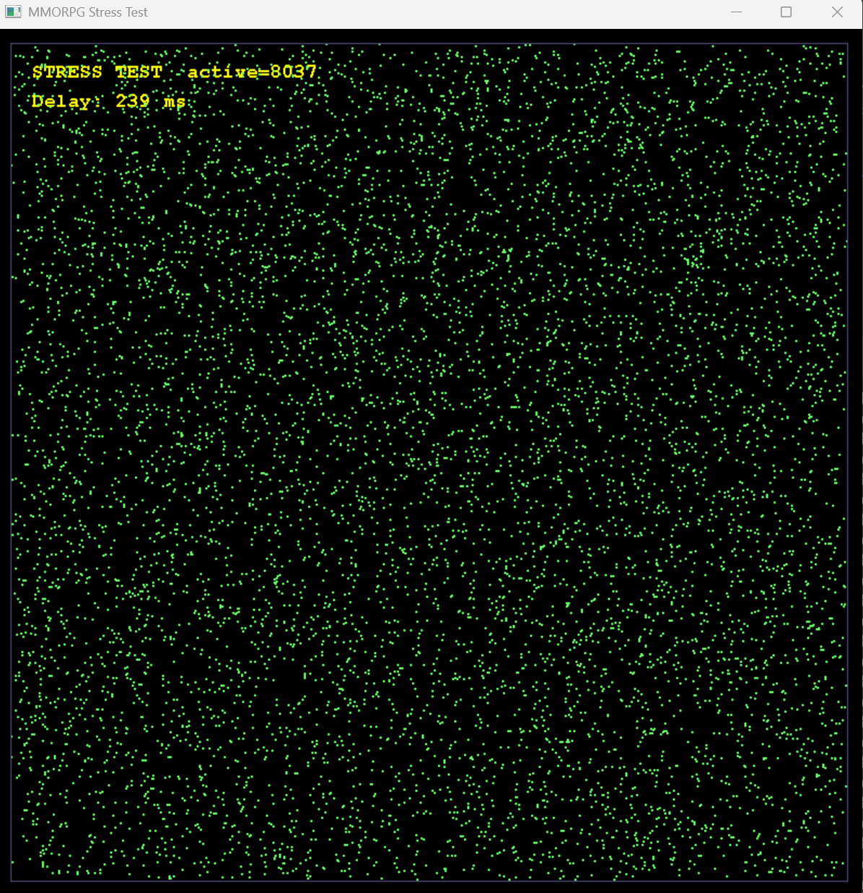

# SIMPLEST MMORPG

IOCP 기반 텍스트 MMORPG 서버 + 콘솔 클라이언트 + 부하 측정 도구.

C++20, Windows, Visual Studio 2022 환경에서 구현. 단일 서버에서 *7000+ 동시 접속**을 처리하며, 200K 몬스터 + 비동기 DB 영속화 + 채팅 + 시야 기반 broadcast를 지원합니다.

> IOCP MMORPG 서버 학습 목적 프로젝트



---

## 기술 스택

| 영역 | 기술 |
|---|---|
| 언어 / 표준 | C++20 (`std::shared_mutex`, `std::atomic`, `operator<=>`, structured bindings) |
| OS / IDE | Windows 11, Visual Studio 2022, MSVC v143 |
| 네트워킹 | Winsock2, IOCP (I/O Completion Port), AcceptEx |
| 데이터베이스 | Microsoft SQL Server 2022, ODBC Driver 18 |
| 스크립팅 | Lua 5.x + sol2 (몬스터 스폰 정의) |
| 시각화 (StressTest) | OpenGL (legacy fixed pipeline) |

---

## 아키텍처 개요

```
                    ┌──────────────┐
        TCP         │  IOCPServer  │
   ┌──────────────► │              │
   │                │ AcceptEx     │
[Clients/Bots]      │ Workers × N  │  N = std::hardware_concurrency() × 2
   │                └──────┬───────┘
   │                       │ dispatch by IOType
   │                       │
   │                ┌──────▼─────────────────────────┐
   │                │   PacketHandler (CS_*)         │
   │                └──────┬─────────────────────────┘
   │                       │
   │                ┌──────▼──────┐
   │                │  GameWorld  │ (Singleton)
   │                │             │
   │                │  m_players  │ (shared_ptr<Player>)
   │                │  m_monsters │ (unique_ptr<Monster> × 200K)
   │                │             │
   │                │  ┌────────┐ │
   │                │  │ Sector │ │ ◄── 100×100 sectors, shared_mutex/sector
   │                │  │Manager │ │     + lock-free tile→ObjectID atomic array
   │                │  └────────┘ │
   │                └──┬───────┬──┘
   │                   │       │
   │           ┌───────┘       └────────┐
   │           ▼                        ▼
   │   ┌─────────────┐           ┌─────────────┐
   │   │TimerManager │           │  DBManager  │
   │   │             │           │             │
   │   │ priority_q  │           │ login worker│
   │   │ + cv wait   │           │ save worker │
   │   │ + obj pool  │           │             │
   │   │             │           │ MSSQL ODBC  │
   │   └──────┬──────┘           │ (4 SP)      │
   │          │                  └──────┬──────┘
   │          │                         │
   │          └──────────┬──────────────┘
   │                     │ PostQueuedCompletionStatus
   └─────────────────────┘    (callback runs on IOCP worker)
```

### 핵심 설계 원칙

1. **모든 게임 로직은 IOCP 워커 위에서 실행.** 별도 게임 스레드 없음. 패킷 → 처리 → 응답이 같은 스레드에서.
2. **DB와 Timer는 별도 스레드 풀로 분리.** 결과는 `PostQueuedCompletionStatus`로 IOCP 큐에 다시 던짐 → 게임 로직 일관성 유지.
3. **Sector + Tile occupation 이중 자료구조.** 시야 broadcast는 sector(공간 인덱스)로, 충돌 검사는 tile occupation(lock-free atomic array)으로.

---

## 프로젝트 구조

```
SIMPLEST-MMORPG/
├── Common/                  # Server/Client 공유
│   ├── Protocol.h           # 패킷 정의 (CS_*, SC_*)
│   ├── Constants.h          # MAX_PLAYERS, MAP_WIDTH 등
│   ├── Map.h/cpp            # 맵 + IsWalkable
│   └── Types.h              # Position, Direction, ObjectID
│
├── Server/
│   ├── Network/
│   │   ├── IOCPServer.cpp   # AcceptEx + worker pool + GQCS dispatch
│   │   ├── Session.cpp      # 클라 연결 단위 + recv 링버퍼 + send 큐
│   │   └── PacketHandler.cpp# CS_* → GameWorld 라우팅
│   ├── Game/
│   │   ├── GameWorld.cpp    # 로그인/이동/공격/채팅 처리, Player·Monster 관리
│   │   ├── SectorManager.cpp# 공간 인덱스 + lock-free tile occupation
│   │   ├── ViewProcessor.cpp# 시야 diff (ADD/REMOVE/MOVE 패킷)
│   │   ├── Player.cpp       # 플레이어 상태 + 쿨다운 + DB 영속화 캐시
│   │   ├── Monster.cpp      # AI (peace/agro × roaming/fixed) + 활성화 상태
│   │   └── Pathfinder.cpp   # A* with 4-direction surround
│   ├── Timer/
│   │   ├── TimerManager.cpp # priority_queue + cv 대기 스레드
│   │   └── TimerOverlappedPool.cpp
│   ├── DB/
│   │   ├── DBConnection.cpp # ODBC raw API, SP 호출
│   │   └── DBManager.cpp    # login/save 워커 + 비동기 작업 큐
│   ├── Lua/LuaManager.cpp   # 몬스터 스폰 데이터 로드
│   └── Logger.h             # LOG_INFO/WARN/ERROR/DEBUG (stdout + 파일)
│
├── Client/                  # 콘솔 기반 텍스트 MMORPG 클라이언트
│   ├── NetworkClient.cpp    # blocking TCP + recv 스레드
│   ├── Renderer.cpp         # CHAR_INFO 더블 버퍼링 + WriteConsoleOutputW
│   ├── InputHandler.cpp     # 게임/채팅 입력 모드 분리
│   └── GameState.cpp        # 자기 정보 + 시야 안 객체들
│
├── StressTest/              # IOCP 기반 부하 측정 도구
│   ├── NetworkModule.cpp    # 비동기 봇 클라이언트 (1만+ 봇 동시)
│   └── DrawModule.cpp       # OpenGL 시각화 (점 분포 + 통계)
│
├── Scripts/
│   └── monster_spawn.lua    # 200K 몬스터 격자 분포 자동 생성
│
└── Data/
    └── map_obstacles.dat    # 맵 장애물 비트맵
```

---

## 주요 기능

### 게임 메커닉
- **이동**: 4방향, 1000ms 쿨다운, 클라 예측 + 서버 검증
- **공격**: 4방향 인접 적에게 동시 타격, 1초 쿨다운, 폭발 이펙트
- **레벨링**: 경험치 누적, 자동 레벨업, 사망 시 50% 패널티
- **HP 자동 회복**: 5초마다 maxHP 10%, lazy 방식 (피격 시작 시 타이머 등록, 풀피 도달 시 종료)
- **몬스터 5종**: Pawn / Knight / Rook / Bishop / Queen — peace/agro × roaming/fixed 조합
- **채팅 2채널**: 시야(21×21 broadcast) / 전체(서버 전체), Tab으로 토글

### 영속성
- **MSSQL 로그인**: 캐릭터 이름으로 자동 로드/생성
- **주기적 저장**: 60초마다 모든 활성 플레이어
- **로그아웃 시 저장**: ProcessDisconnect에서 스냅샷 → 비동기 큐
- **last_login 갱신**: 로그인 직후 비동기 UPDATE

### 부하 측정 (StressTest)
- **IOCP 비동기 클라이언트**: 1만+ 봇을 6개 워커로 처리
- **적응형 부하 조절**: round-trip latency 기반 ramp 속도 조정
  - delay < 100ms → 50ms마다 1봇 추가
  - delay 100~150ms → 1/10 속도
  - delay > 500ms → 영구 정지 (한계 도달)
- **OpenGL 시각화**: 봇 위치를 점으로, 통계를 텍스트로 표시
- **Latency 측정**: CS_Move의 `move_time` 필드를 서버가 echo, round-trip 계산

---

## 설계 하이라이트

### 1. Lock-free Tile Occupation Map

충돌 검사를 위해 모든 타일의 점유 객체 ID를 atomic array로 관리.

```cpp
std::vector<std::atomic<ObjectID>> m_tileToObject;  // 4M 타일

bool TryClaim(int16_t x, int16_t y, ObjectID id) {
    ObjectID expected = INVALID_ID;
    return m_tileToObject[y * MAP_WIDTH + x].compare_exchange_strong(expected, id);
}
```

- **Write**: CAS 1회, 성공이면 점유 확정
- **Read**: load 1회, 락 없음
- **이동**: 두 atomic CAS (old 해제 + new 획득)
- 16MB 고정 메모리 (4M × 4byte) — 대규모 맵에 적합

기존 `unordered_map<Position, ObjectID> + mutex` 대비 락 경합 제거 + cache locality 향상.

### 2. A* 4방향 포위 (Surround Pursuit)

다수 몬스터가 한 플레이어 추격 시 줄서기 문제 해결.

```cpp
// 각 몬스터가 플레이어 4방향 surround 타일 중
// 비점유 + 자기에게 가장 가까운 타일을 목표로 A*
for (int i = 0; i < 4; ++i) {
    int16_t cx = playerX + DX[i];
    int16_t cy = playerY + DY[i];
    if (occupied(cx, cy) || !walkable(cx, cy)) continue;
    if (closer than best) goalPos = {cx, cy};
}
auto path = Pathfinder::FindPath(myX, myY, goalPos.x, goalPos.y);
```

5마리가 같은 방향에서 접근해도 자연스럽게 N/E/S/W로 분산.

### 3. Activation-Based Monster AI

200K 몬스터 전체에 매 tick AI 돌리지 않음. **플레이어 시야에 들어왔을 때만** 활성화.

```cpp
class Monster {
    std::atomic<bool> m_isActive{false};
public:
    bool TryActivate() {
        bool expected = false;
        return m_isActive.compare_exchange_strong(expected, true);
    }
};

// 플레이어 시야 갱신 시
ActivateNearbyMonsters(x, y) → 시야 안 몬스터 중 inactive면 CAS로 활성화 → MONSTER_AI 타이머 등록
```

부담: 200K × 1초 = 200K AI tick/sec → 활성 N개만 = 보통 수천 tick/sec.

### 4. 비동기 DB 워커 (Login + Save 분리)

DB I/O로 IOCP 워커가 막히면 게임 전체 freeze. 별도 스레드 풀로 분리.

```cpp
// IOCP 워커
DBManager::PostLoginTask([sessionId, name](DBConnection& db) {
    PlayerRow row;
    bool found;
    db.LoadPlayerByName(name, row, found);   // 블로킹 ODBC 호출, 별도 스레드
    if (!found) db.CreatePlayer(name, ...);

    DBManager::InvokeOnIOCP([sessionId, row]() {
        GameWorld::OnLoginDBLoaded(sessionId, row);   // IOCP 워커로 다시 던짐
    });
});
```

큐 분리 이유: save 큐가 막혀도 login은 계속 (사용자 체감 가장 중요).

### 5. Lazy HP Regeneration

매 5초 모든 플레이어 검사 x → 피격 시 타이머 시작, 풀피 도달 시 종료.

```cpp
// 피격 시
if (!victim->IsDead() && victim->TryStartRegen()) {  // CAS로 중복 등록 방지
    TimerManager::AddTimer(HP_REGEN, victim->GetId(), 5000);
}

// HP_REGEN 타이머 발화
if (player->GetHp() >= player->GetMaxHp()) {
    StopRegenAndMaybeRestart(player.get());  // 종료 + 그 사이 재피격 시 재시작 (race-free)
} else {
    RegenHP();
    AddTimer(HP_REGEN, ...);  // 다음 tick
}
```

3000명 동접 시 600 idle event/sec → 50 active event/sec 수준으로 부하 1/12 감소.

### 6. Move Latency 측정 (Round-trip Echo)

```cpp
// 봇 (StressTest)
CS_Move pkt;
pkt.move_time = NowMs();        // 송신 시각 박아넣음
SendPacket(&pkt);

// 서버
SC_MoveObject ack;
ack.move_time = pkt->move_time; // 그대로 echo
session->SendPacket(&ack);

// 봇 수신 시
int64_t round_trip = NowMs() - pkt->move_time;
```


---

## 빌드 + 실행

### 사전 준비

1. **Visual Studio 2022** + C++ 데스크톱 워크로드
2. **Microsoft SQL Server 2022 Developer Edition** + SSMS
3. **ODBC Driver 18 for SQL Server**

### DB 셋업

SSMS에서 실행:

```sql
CREATE DATABASE mmorpg_dev;
GO

USE master;
CREATE LOGIN mmorpg_user WITH PASSWORD = 'YourPassword!';
GO

USE mmorpg_dev;
CREATE USER mmorpg_user FOR LOGIN mmorpg_user;
ALTER ROLE db_owner ADD MEMBER mmorpg_user;
GO

-- Players 테이블 + 4 SP (sp_LoadPlayerByName, sp_CreatePlayer, sp_SavePlayer, sp_UpdateLastLogin)
-- Server/schema.sql 참고
```

Mixed Mode 인증 활성화 + TCP/IP 포트 1433 활성화 + SQL Server 재시작.

### 빌드

```
SIMPLEST-MMORPG.sln 열기 → Release | x64 → 솔루션 빌드
```

### 실행 순서

1. **서버**: `Server/x64/Release/Server.exe`
   - 환경변수 `MMORPG_DB_PASSWORD` 설정 (옵션, 기본값 코드에 박혀있음)
2. **클라이언트**: `Client/x64/Release/Client.exe`
   - 이름 입력 → Enter → 게임 진입
3. **부하 측정** (선택): `StressTest/x64/Release/StressTest.exe`
   - 자동으로 `127.0.0.1:9000` 에 봇 생성

조작:
- 화살표: 이동
- 스페이스: 공격
- Enter: 채팅 모드 진입 / 송신
- Tab (채팅 모드): VIEW ↔ GLOBAL 채널 토글
- ESC: 채팅 취소 또는 게임 종료

---

## 측정 결과

### 환경

| 항목 | 값 |
|---|---|
| 서버 PC | 단일 데스크탑 (자가 부하) |
| 맵 크기 | 2000 × 2000 (4M 타일) |
| 몬스터 수 | 200,000 (Lua 격자 분포, 5종 혼합) |
| 봇 행동 | 1초마다 랜덤 4방향 이동 + 즉시 텔레포트 분산 |

### 결과

```
시나리오 1: 단일 PC (서버 + 부하 생성기)
  - 안정 동접: ~6,000~8,000
  - 한계 신호: round-trip 100ms 도달 시점에서 ramp 정지
  - 비고: CPU 자원이 두 프로세스에 분산됨, 실제 서버 한계는 더 높을 것

시나리오 2: 분리 PC (저사양 부하 PC)
  - 안정 동접: ~1,600
  - 한계 신호: 네트워크 latency 누적으로 임계 도달
  - 비고: 부하 PC CPU 40%대 (idle 가까움), 서버는 여유 있었음
  - 측정 알고리즘 한계 — 진짜 서버 한도 측정엔 동급 이상 부하 PC 또는 다중 부하 PC 필요
```



> StressTest 시각화 — 봇 약 8000명이 2000×2000 맵 전체에 분산된 모습. 좌상단에 active 동접 + 측정된 round-trip delay 표시.

### 메모리 사용량 (서버, 7000+ 동접 시)

- 200K Monster 객체: ~30MB
- Tile occupation map: 16MB
- Session × 7000: ~75MB
- 기타: ~30MB
- **합계 약 150~200MB**

---

## 한계 및 향후 개선

### 미구현 기능

- **인증**: 현재 이름만으로 로그인. 비밀번호 + 해시 + salt 적용 필요.
- **Redis 캐싱**: 단일 서버라 보류. 분산 환경 도입 시 LoadPlayerByName 캐시, 동접자 수 등 활용 가능.
- **분산 서버**: 단일 IOCP 인스턴스. zone 분할 + 채널 분할 가능하지만 여기선 안 함.
- **스킬 / 아이템 / 인벤토리**: 전투는 평타만. 스킬 시스템 없음.
- **WAITING_LOGIN UI**: 클라가 SC_LOGIN_OK 받기 전 IN_GAME 상태로 진입. 보통은 응답 대기 화면이 더 부드러움.

---

## 회고

### 좋았던 점

- **Lock-free 점유 맵**으로 충돌 검사 핫패스에서 락 제거. 부하 테스트 결과 m_playersMutex 경합 거의 없었음.
- **A* 4방향 포위**로 직관적이지 않은 줄서기 버그를 게임 디자인 측면에서 자연스럽게 해결.
- **비동기 DB**의 두 단계(워커 → IOCP 콜백) 패턴이 깔끔. 게임 로직은 단일 컨텍스트(IOCP 워커)에서만 실행되므로 락 정책 일관.
- **TimerManager + ObjectPool**로 타이머 객체 풀링. 7000+ 동접에서도 메모리 안정.

### 아쉬웠던 점

- **shared_mutex 재진입 금지** 문제. GetPlayer 안에서 또 다른 GetPlayer 호출하면 deadlock 위험. snapshot 패턴 도입.
- **IOCP UAF 트랩**. delete session 후 다른 워커가 그 포인터 사용하는 race. 진단 어렵고 재현 불안정.
- **ODBC 첫 학습**. SQLBindParameter / SQLBindCol / 진단 메시지 등 raw API 익히기. SP 호출 패턴(`{CALL ...}`) 의 의미 파악.
- **race condition 디버깅**. 단일 스레드 테스트는 통과해도 동시성 환경에서 깨지는 케이스 다수.

### 다음에 한다면

1. **Session shared_ptr 전환**: 처음부터 lifetime을 RAII로 잡으면 UAF 트랩 없음.
2. **Generation counter ID**: session id가 재사용될 때 stale reference 자동 무효화.
3. **테스트 기반 개발**: race condition은 unit test로 잡기 어려우니 model checking + property-based test 같은 기법 도입.
4. **ECS 패턴**: 기능 추가 시 Player/Monster 클래스 비대화 가속. ECS로 분리하면 쉬워짐.
5. **메트릭 수집 인프라**: 패킷 처리량 / 평균 latency / mutex 경합 등을 PerfMon counter로 노출 → 진단 자동화.

---

## 라이선스

학습용 / 포트폴리오용. 별도 라이선스 미부여.
